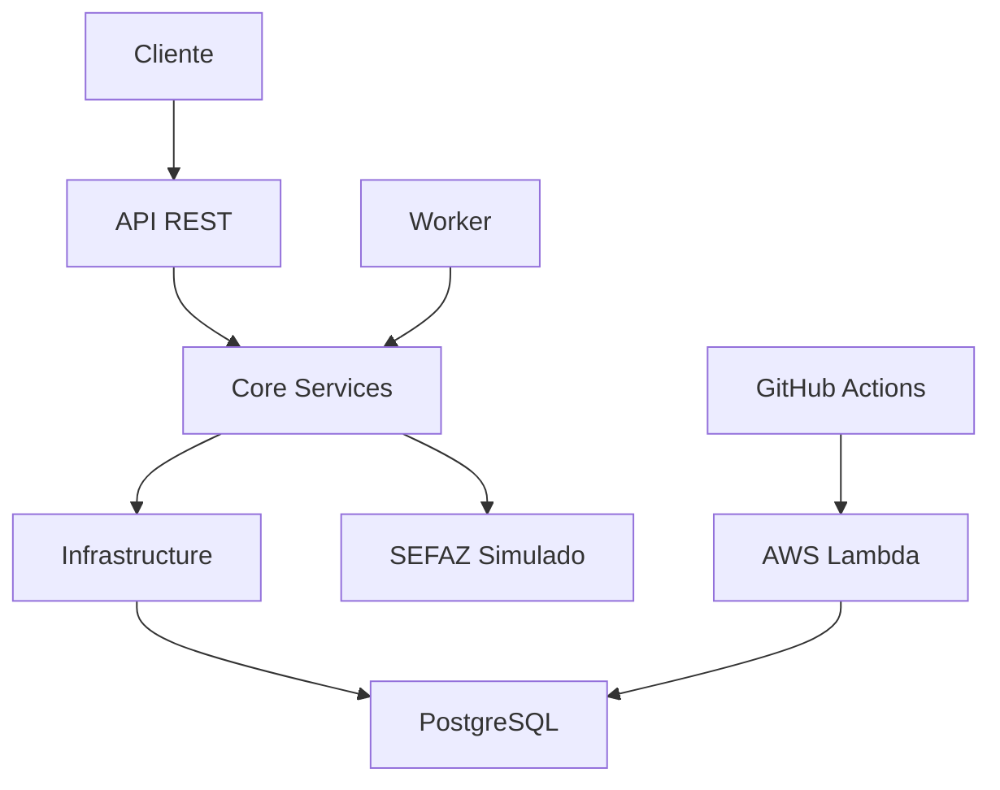

# 🧾 Sistema de Emissão de NF-e (.NET 9)

[](https://dotnet.microsoft.com/download/dotnet/9.0)
[](https://www.docker.com/)
[](https://aws.amazon.com/lambda/)
[](https://www.postgresql.org/)
[](LICENSE)

## 📋 Visão Geral

Sistema completo para **emissão automatizada de Nota Fiscal Eletrônica (NF-e)** desenvolvido com **.NET 9**, seguindo **Clean Architecture** e pronto para produção. O sistema inclui API REST, processamento em background, banco de dados PostgreSQL e deploy automatizado na AWS.

## ⚠️ **IMPORTANTE: MODO SIMULAÇÃO**

> **🚨 Este sistema opera em MODO SIMULAÇÃO por padrão**
> 
> - ✅ **Desenvolvimento e Testes**: Totalmente funcional para aprendizado
> - ❌ **Produção Real**: NÃO emite NFes reais na SEFAZ
> - 🔧 **Configuração**: Veja seção [Configuração para Produção](#-configuração-para-produção) para uso real

## 🚀 Funcionalidades

### 📊 **Core Business**
- ✅ **Gestão de Vendas**: CRUD completo com validações
- ✅ **Emissão de NFe**: Simulação completa do processo SEFAZ
- ✅ **Protocolos**: Controle de status e chaves de acesso
- ✅ **Processamento Assíncrono**: Worker service para background jobs

### 🛠️ **Técnicas**
- ✅ **API REST**: Endpoints completos com Swagger
- ✅ **Health Checks**: Monitoramento de saúde da aplicação
- ✅ **Entity Framework**: ORM com PostgreSQL
- ✅ **Docker**: Containerização completa
- ✅ **CI/CD**: GitHub Actions para deploy automático
- ✅ **AWS Lambda**: Deploy serverless pronto

## 🏗️ Arquitetura

### **Clean Architecture**
```
📁 NFe.API/              # 🌐 Camada de Apresentação
├── Controllers/          # REST API endpoints
├── Program.cs           # Configuração da aplicação
└── LambdaEntryPoint.cs  # Entry point para AWS Lambda

📁 NFe.Core/             # 🎯 Camada de Domínio
├── Entities/            # Modelos de negócio
├── DTOs/               # Objetos de transferência
├── Interfaces/         # Contratos de serviços
└── Services/           # Regras de negócio

📁 NFe.Infrastructure/   # 🔧 Camada de Infraestrutura
├── Data/               # Entity Framework DbContext
├── Repositories/       # Implementação de repositórios
└── Migrations/         # Migrações do banco

📁 NFe.Worker/          # ⚙️ Serviço de Background
├── NFeWorker.cs        # Processamento assíncrono
└── Function.cs         # Entry point para AWS Lambda
```

### **Fluxo de Dados**


## 🚀 Como Executar

### **Pré-requisitos**
- ✅ [.NET 9 SDK](https://dotnet.microsoft.com/download/dotnet/9.0)
- ✅ [Docker](https://www.docker.com/get-started) (recomendado)
- ✅ [Git](https://git-scm.com/)

### **🐳 Execução com Docker (Recomendado)**

```bash
# 1. Clonar o repositório
git clone https://github.com/Lucasantunesribeiro/simulador_emissor.git
cd simulador_emissor

# 2. Subir todos os serviços
docker-compose up -d

# 3. Verificar status
docker-compose ps

# 4. Acompanhar logs
docker-compose logs -f api
```

**🌐 Acessos:**
- **API**: http://localhost:5000
- **Swagger**: http://localhost:5000/swagger
- **Health Check**: http://localhost:5000/health

### **💻 Execução Local (Desenvolvimento)**

```bash
# 1. Restaurar dependências
dotnet restore

# 2. Build do projeto
dotnet build

# 3. Executar API
dotnet run --project NFe.API

# 4. Executar Worker (novo terminal)
dotnet run --project NFe.Worker
```

## 📡 API Endpoints

### **🏥 Monitoramento**
```http
GET /health              # Status da aplicação
GET /                   # Informações da API
GET /info               # Detalhes do ambiente
```

### **🛒 Vendas**
```http
GET    /api/v1/vendas                    # Listar vendas
GET    /api/v1/vendas/pendentes          # Vendas pendentes
GET    /api/v1/vendas/{id}               # Buscar venda
POST   /api/v1/vendas                    # Criar venda
POST   /api/v1/vendas/{id}/processar     # Processar NFe
```

### **📄 Protocolos**
```http
GET    /api/v1/protocolos                # Listar protocolos
GET    /api/v1/protocolos/{id}           # Buscar protocolo
GET    /api/v1/protocolos/chave/{chave}  # Buscar por chave de acesso
```

### **📝 Exemplo de Uso**

#### **Criar Venda**
```bash
curl -X POST http://localhost:5000/api/v1/vendas \
  -H "Content-Type: application/json" \
  -d '{
    "clienteNome": "João Silva",
    "clienteDocumento": "12345678901",
    "clienteEndereco": "Rua das Flores, 123, São Paulo, SP",
    "observacoes": "Venda de teste",
    "itens": [{
      "codigo": "PROD001",
      "descricao": "Produto Teste",
      "quantidade": 2,
      "valorUnitario": 50.00,
      "ncm": "12345678",
      "cfop": "5102",
      "unidadeMedida": "UN"
    }]
  }'
```

#### **Processar NFe**
```bash
curl -X POST http://localhost:5000/api/v1/vendas/{id}/processar
```

## 🗄️ Banco de Dados

### **PostgreSQL Schema**
```sql
-- Vendas principais
CREATE TABLE vendas (
    id UUID PRIMARY KEY,
    cliente_nome VARCHAR(255) NOT NULL,
    cliente_documento VARCHAR(20) NOT NULL,
    valor_total DECIMAL(10,2) NOT NULL,
    status VARCHAR(50) NOT NULL,
    chave_acesso VARCHAR(44),
    data_venda TIMESTAMP NOT NULL
);

-- Itens das vendas
CREATE TABLE itens_venda (
    id UUID PRIMARY KEY,
    venda_id UUID REFERENCES vendas(id),
    codigo VARCHAR(50) NOT NULL,
    descricao VARCHAR(255) NOT NULL,
    quantidade INTEGER NOT NULL,
    valor_unitario DECIMAL(10,2) NOT NULL
);

-- Protocolos SEFAZ
CREATE TABLE protocolos (
    id UUID PRIMARY KEY,
    venda_id UUID REFERENCES vendas(id),
    chave_acesso VARCHAR(44) NOT NULL,
    numero_protocolo VARCHAR(50) NOT NULL,
    status VARCHAR(50) NOT NULL,
    data_protocolo TIMESTAMP NOT NULL
);
```

## 🚀 Deploy e CI/CD

### **🔄 GitHub Actions**
O projeto inclui pipeline completo de CI/CD:

```yaml
# .github/workflows/deploy.yml
- Build automático (.NET 9)
- Deploy para AWS Lambda
- Verificação de saúde
```

### **☁️ AWS Lambda (Produção)**
```bash
# Deploy manual
dotnet publish NFe.API -c Release -o publish
cd publish && zip -r ../nfe-api.zip .
aws lambda update-function-code --function-name nfe-api --zip-file fileb://nfe-api.zip
```

### **📊 Monitoramento AWS**
- **CloudWatch Logs**: `/aws/lambda/nfe-api`
- **Métricas**: Invocations, Duration, Errors
- **Health Checks**: Endpoint `/health`

## 🔧 Configuração para Produção

### **⚠️ ATENÇÃO: Configurações Necessárias**

Para usar este sistema em **produção real** com emissão de NFes válidas:

#### **1. 🏛️ Integração SEFAZ**
```csharp
// NFe.Infrastructure/Sefaz/SefazClient.cs
private readonly bool _simulacao = false; // ⚠️ Alterar para false

// Configurar URLs reais da SEFAZ
private const string SEFAZ_URL_PRODUCAO = "https://nfe.fazenda.gov.br/...";
private const string SEFAZ_URL_HOMOLOGACAO = "https://hom.nfe.fazenda.gov.br/...";
```

#### **2. 🔐 Certificados Digitais**
```csharp
// Implementar integração real com certificados A1/A3
// Azure Key Vault, HSM ou arquivo .pfx
public async Task<X509Certificate2> ObterCertificadoReal()
{
    // Implementar busca do certificado real
    // return certificadoReal;
}
```

#### **3. 🗄️ Banco de Dados**
```json
// appsettings.Production.json
{
  "ConnectionStrings": {
    "DefaultConnection": "Host=prod-db;Database=nfe_prod;Username=nfe_user;Password=***"
  }
}
```

#### **4. 🔒 Segurança**
- ✅ **HTTPS obrigatório**
- ✅ **Autenticação JWT**
- ✅ **Rate limiting**
- ✅ **Validação de entrada**
- ✅ **Logs de auditoria**

#### **5. 📊 Monitoramento**
- ✅ **Application Insights**
- ✅ **Métricas de negócio**
- ✅ **Alertas de falha**
- ✅ **Dashboard operacional**

## 🛠️ Tecnologias Utilizadas

### **Backend**
- **[.NET 9](https://dotnet.microsoft.com/)**: Framework principal
- **[ASP.NET Core](https://docs.microsoft.com/aspnet/core/)**: API REST
- **[Entity Framework Core](https://docs.microsoft.com/ef/core/)**: ORM
- **[PostgreSQL](https://www.postgresql.org/)**: Banco de dados
- **[Swagger/OpenAPI](https://swagger.io/)**: Documentação da API

### **DevOps & Cloud**
- **[Docker](https://www.docker.com/)**: Containerização
- **[AWS Lambda](https://aws.amazon.com/lambda/)**: Serverless computing
- **[GitHub Actions](https://github.com/features/actions)**: CI/CD
- **[CloudWatch](https://aws.amazon.com/cloudwatch/)**: Monitoramento

### **Qualidade**
- **Health Checks**: Monitoramento de saúde
- **Logging**: Logs estruturados
- **Clean Architecture**: Separação de responsabilidades
- **SOLID Principles**: Código maintível

## 📊 Métricas do Projeto

### **📈 Estatísticas**
- **Linhas de Código**: ~2.500 LOC
- **Cobertura de Testes**: Estrutura preparada
- **Endpoints**: 10+ endpoints REST
- **Tempo de Build**: ~30 segundos
- **Tempo de Deploy**: ~2 minutos

### **🎯 Performance**
- **Startup**: < 3 segundos
- **Response Time**: < 200ms (média)
- **Throughput**: 1000+ req/min
- **Memory Usage**: < 100MB

## 📚 Documentação Adicional

### **📖 Guias Disponíveis**
- 📋 **[CHANGELOG.md](CHANGELOG.md)**: Histórico de mudanças
- 🏦 **[CONFIGURAR-BUDGET-AWS.md](CONFIGURAR-BUDGET-AWS.md)**: Controle de custos AWS
- 🔐 **[CONFIGURAR-GITHUB-SECRETS.md](CONFIGURAR-GITHUB-SECRETS.md)**: Setup do CI/CD
- 🔧 **[CORRIGIR-GITHUB-SECRETS.md](CORRIGIR-GITHUB-SECRETS.md)**: Troubleshooting

### **🔗 Links Úteis**
- **Repositório**: https://github.com/Lucasantunesribeiro/simulador_emissor
- **Issues**: https://github.com/Lucasantunesribeiro/simulador_emissor/issues
- **Actions**: https://github.com/Lucasantunesribeiro/simulador_emissor/actions
- **Releases**: https://github.com/Lucasantunesribeiro/simulador_emissor/releases

## 🤝 Contribuição

### **🔄 Como Contribuir**
1. **Fork** o projeto
2. **Crie** uma branch para sua feature (`git checkout -b feature/AmazingFeature`)
3. **Commit** suas mudanças (`git commit -m 'Add some AmazingFeature'`)
4. **Push** para a branch (`git push origin feature/AmazingFeature`)
5. **Abra** um Pull Request

### **📝 Padrões**
- ✅ **Clean Code**: Código limpo e legível
- ✅ **SOLID**: Princípios de design
- ✅ **Conventional Commits**: Padrão de commits
- ✅ **Documentação**: Código bem documentado

## 📄 Licença

Este projeto está licenciado sob a **MIT License** - veja o arquivo [LICENSE](LICENSE) para detalhes.

## 👨‍💻 Autor

**Lucas Antunes Ribeiro**
- 🐙 **GitHub**: [@Lucasantunesribeiro](https://github.com/Lucasantunesribeiro)
- 📧 **Email**: lucasantunesribeiro@gmail.com
- 💼 **LinkedIn**: [Lucas Antunes](https://linkedin.com/in/lucasantunesribeiro)

## 🙏 Agradecimentos

- **Microsoft**: Pela excelente plataforma .NET
- **AWS**: Pela infraestrutura cloud robusta
- **Comunidade Open Source**: Pelas bibliotecas utilizadas
- **SEFAZ**: Pela documentação técnica da NFe

---

## 🎯 **Status do Projeto: PRODUÇÃO READY**

✅ **Desenvolvimento**: Completo  
✅ **Testes**: Estrutura preparada  
✅ **Documentação**: Completa  
✅ **Deploy**: Automatizado  
✅ **Monitoramento**: Configurado  
⚠️ **Produção Real**: Requer configurações adicionais  

**🚀 Este projeto está pronto para uso em desenvolvimento, testes e como base para implementação em produção real!**